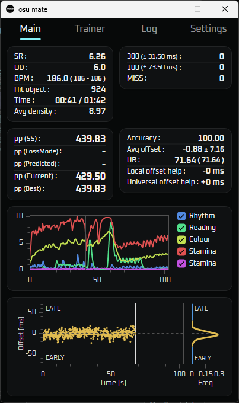
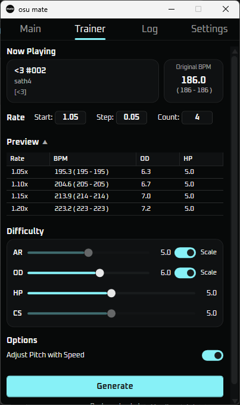
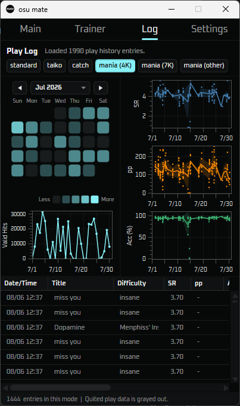
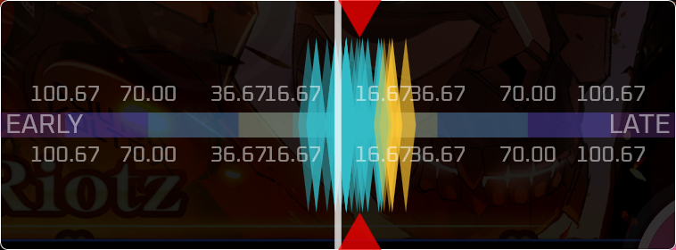
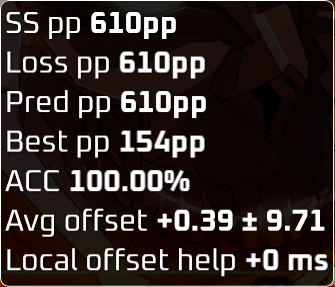

# osu! mate

A companion desktop tool for **osu!** (Windows, C# / WPF).



## Features

- **Real-time PP / difficulty display** while playing (built on `ppy.osu.Game` libraries)
- **Trainer**: live AR/OD/HP/CS simulation and generation of speed-changed audio (rate/tempo, via NAudio + SoundTouch.Net)

- **Play log**: local play history tracking and a GitHub-style contribution graph

- **UR bar / UR graph**: visualize hit-timing deviation (unstable rate)

- **In-game overlay**: lightweight on-screen info overlay


## Requirements

- Windows 10/11 (x64)
- [.NET 8 Desktop Runtime](https://dotnet.microsoft.com/download/dotnet/8.0) (not required if you use a self-contained release build)
- osu! (stable)

## Installation

1. Download the latest zip from the [Releases](../../releases) page
2. Extract it and run `osu-mate.exe`

## Building from source

```bash
git clone https://github.com/KITE-hub/osu-mate.git
cd osu-mate
dotnet restore
dotnet build -c Release
```

## Credits

This project was inspired by / references the following open-source projects:

- [RealtimePPUR](https://github.com/puk06/RealtimePPUR) by [puk06](https://github.com/puk06)
- [osu-trainer](https://github.com/funorange/osu-trainer) by [funorange](https://github.com/funorange)

## License

The source code of this project is licensed under the GNU General Public License v3.0 (GPL-3.0). See LICENSE for the full text.

This means that if you redistribute a modified version of this program, you must also make the modified source code available under GPL-3.0.
